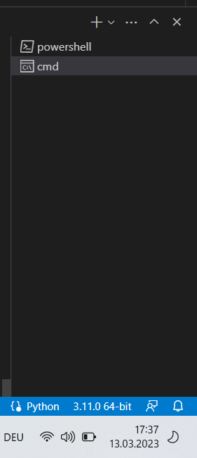

# Anaconda

Availability for OS: Linux, OS X, Windows
Description: Distribution
Notes: can be installed locally

| Software     | Anaconda                |
| ------------ | ----------------------- |
| Objective    | Environments for python |
| Owner        | Carolina Guidolin       |
| Reviewer     | Marcelo Stegmann        |
| Approver     | Hannah S. Heinrichs     |
| Contributors | Max Dobberkau           |
| Version      | 1.0.0                   |
| Last edit    | Max Dobberkau           |
| Date         | 28.03.2023              |

## Installation

- Follow instructions at [Anaconda.com](https://www.anaconda.com/products/distribution)
- Once you started the anaconda.exe, tick the “Add anaconda to my PATH environment variable”.


[conda-cheatsheet.pdf](img/conda-cheatsheet.pdf)

## Conda Set-up in VSCode

- Create a file under your working folder in VS Code (to do this, see: [Visual Studio Code](https://www.notion.so/Visual-Studio-Code-d2b91b39d10a48eba1b8cdb2a3ace365) How-to)
- Open a new Terminal and select **_cmd_** on the RHS (not ****\*\*\*****powershell!****\*\*\*****)
  
  **Important note : if you are on mac, you should use zsh since cmd is windows specific**
- In the terminal, type:

```python
conda activate
```

- This will create a base conda environment. However, we want to create another environment where we can play around with Python code that is not the base one (here called **\***blub**\***). To do this, type:

```python
conda create --name blub python=3.11
```

- To check that you have actually created a new environment:

```python
conda env list
```

- To activate the newly created environment

```python
conda activate blub
```

- Before starting your project, you also want to select your interpreter at the bottom right of your terminal - we want to change from Python (version installed on your laptop) to the one you have in your conda environment
  
- By clicking on 3.11.2 64-bit etc, this window will pop up:
  
- We want to select the conda env that you are using
  
  If you did it right, you should now see the name of your conda environment
- Never work in the base environment! Always do things in the generated environment
  - Recommended: create an environment for every “big project” you work on.

## Useful Packages

N.B.: It is recommended, when possible, to use conda (see table below) to install new packages. When conda does not have the package of interest, google other ways of doing this (make sure you trust what you find though)

### General packages

| Package                                | Purpose                                                 | Command (check on website !!!)       | Notes                                                                                                                                                                                                                                          |
| -------------------------------------- | ------------------------------------------------------- | ------------------------------------ | ---------------------------------------------------------------------------------------------------------------------------------------------------------------------------------------------------------------------------------------------- |
| Numpy                                  | Numeric calculations, linear algebra, etc.              | conda install -c conda-forge numpy   |                                                                                                                                                                                                                                                |
| Pandas                                 | For dataframes                                          | conda install -c conda-forge pandas  |                                                                                                                                                                                                                                                |
| Jupyter                                | Jupyter notebooks                                       | conda install -c conda-forge jupyter |                                                                                                                                                                                                                                                |
| https://anaconda.org/conda-forge/mamba | Package manager that is more efficient than basic conda | conda install -c conda-forge mamba   | Once you have installed mamba, you can replace all your conda commands with mamba, e.g. mamba install -c conda-forge pandas; mamba better in sorting out compatibility issues between packages and way faster than conda. Perspective: you can |
|                                        |                                                         |                                      |                                                                                                                                                                                                                                                |

### Lab-specific packages

(install only in conda environment of the appropriate project !!)

- PyActigraphy

  - Link to installation [here](https://pypi.org/project/pyActigraphy/)
  - Package manager: pip
  - Procedure

    1. PyActigraphy installition has to go through pip
    2. Problem is: installing pyActigraphy through pip will automatically install many packages which are better to be installed by conda
    3. Please install the following packages through conda _before_ you install PyActigraphy

       - texttable, pytz, lml, tenacity, pyparsing, pyexcel-io, pillow, numpy, lxml, llvmlite, kiwisolver, joblib, future, fonttools, et-xmlfile, cycler, chardet, asteval, uncertainties, scipy, pyexcel-ezodf, pyexcel, plotly, patsy, pandas, openpyxl, numba, contourpy, stochastic, statsmodels, pyexcel-xlsx, pyexcel-ods3, matplotlib, lmfit, spm1d
       - You can to this in one go:

       ```python
       conda install -c conda-forge package1 package2 package3
       ```

       separated by a single space

    4. Finally, we can download PyActigraphy:

    ```
    pip3 install pyActigraphy
    ```
