# GitHub pull request tutorial

Once you have created your github account, you have acces to many options : 

- Create repositories
- Access other repositories
- Request pulls

# Here we will look at pull requests :

## First steps

### **For this you will have to go on [github.com](http://github.com) on your browser**

- First things first go to the main repository you want to work on :

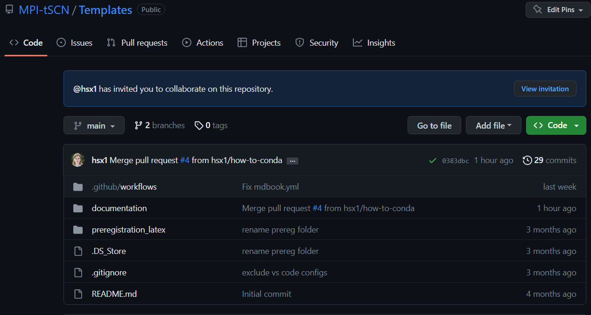

**We will be working on the MPI-tSCN’s repository called “Templates” (see on top left of the screenshot)**

**The easiest way is to do the changes and the pull request online**

- You will have to fork the repository you want to work on :
    - At the top right click on “fork”, I have already forked this repository so it shows it as “<username>/<fork_name>

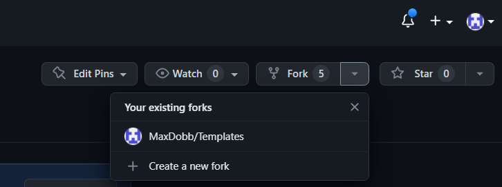

- Once you forked the repository, go to **YOUR** repository by clicking on your profile picture on the top right of the webpage, you will then see your personal repositories :

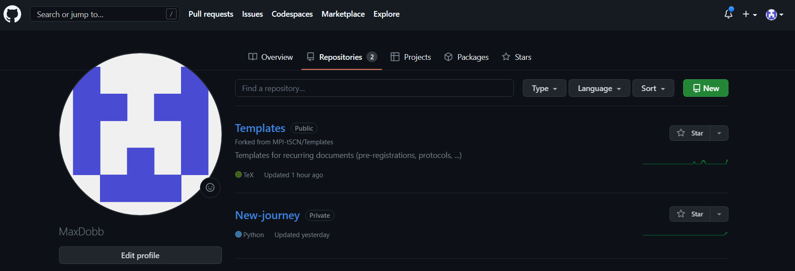

- If you now click on “Templates”, it will open the fork, a copy, of the repository you want to modify
    - You can now modify “Templates” in your private repositories **WITHOUT** interacting with the main “Templates” branch
        
        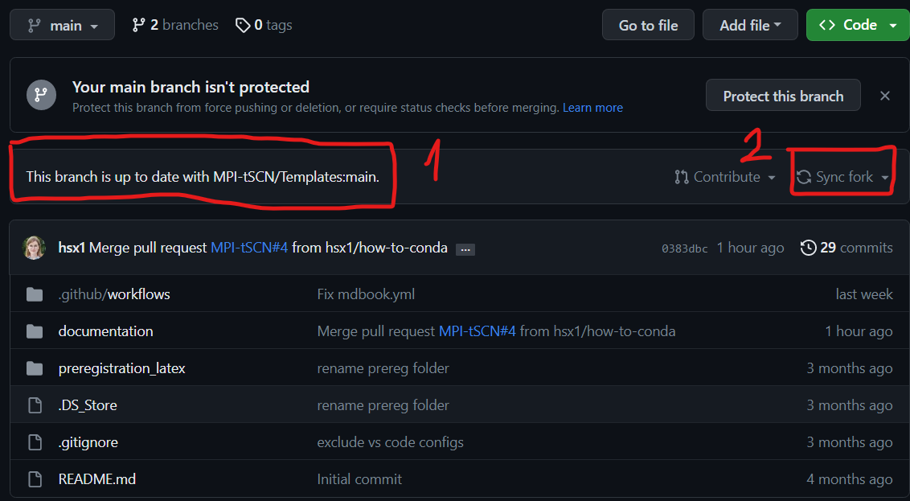
        
        **Always make sure that your forked branch is up to date with the main one, if not go to “Sync fork”**
        
- You now have an up to date modifiable version of the protected main branch

### Now you are free to modify whatever you would like to, let’s say I want to edit the markdown file under *Templates/Documentation/src/how-tos/conda/conda.md*

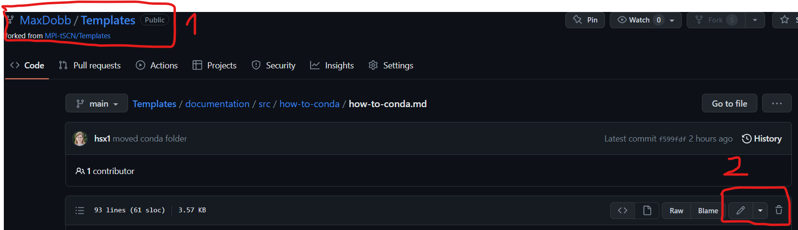

**You can check in the ‘1’ area that you are in your personal repository and not the main branch. The ‘2’ area is used to edit the file.**

- Click on the pen marked ‘2’ on the screen above and modify the document as you please. Once it’s done : scroll down and do click on “commit changes”

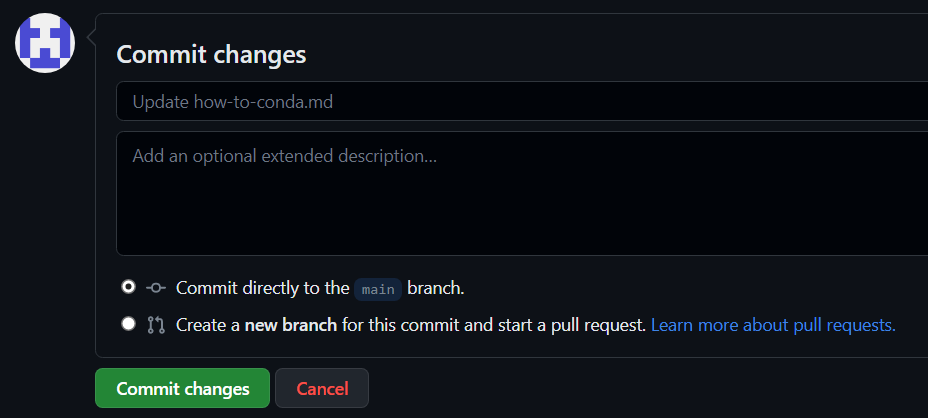

## Add files or documents

let’s say you want to add a file under *Templates/Documentation/src/how-to-conda/*

- simply go to the “add file” section and “Upload file”

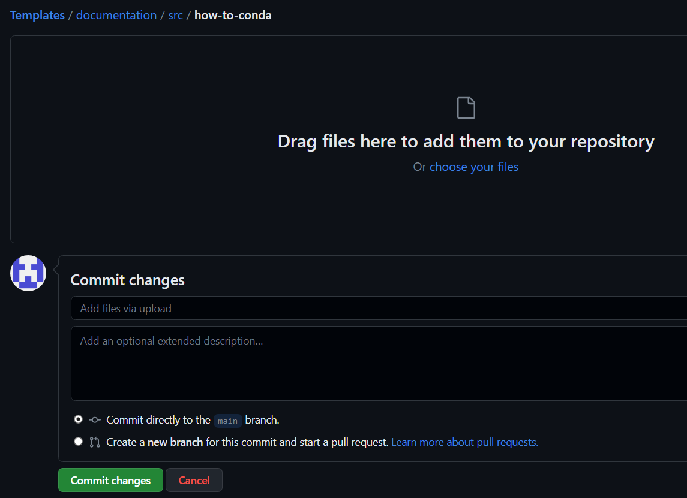

### Note that the files have to be in a specific format :

- For tutorials : put them in Templates/documents/src/how-tos
    - Create a new folder called <name of your tutorial> (ex: conda for “anacondas”)
    - **NEVER use capital letters or spaces**
- inside this new folder :
    - put a ‘main.md’ file for the markdown page you did
    - put an ‘img’ folder for the images in .png or .jpg and the pdf contained in the markdown page

## Pull request

### Once the changes are done, we can move on to the Pull request :

- Go to the “Pull request” tab and “New pull request” :

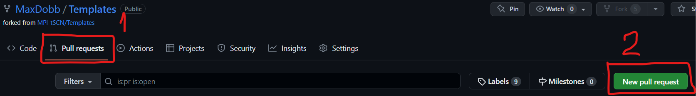

- Then check the changed documents and the changes that were made :

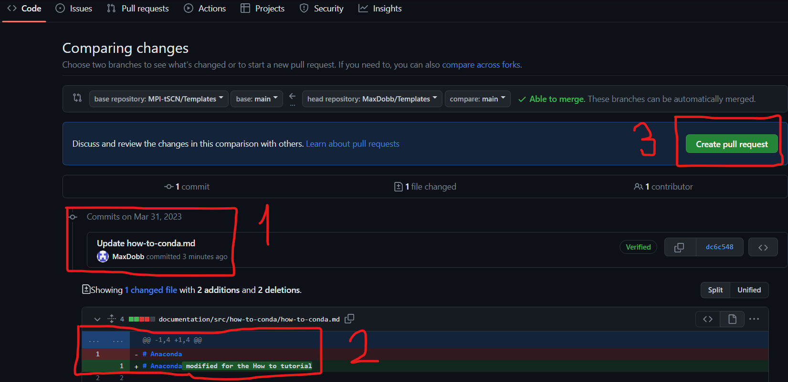

**’1’ shows the modified documents, ‘2’ shows the actual changes. Once everything looks fine to you, you can tap ‘3’ “Create pull request”** 

- This pull request will have to be reviewed and accepted by an admin of the MPI-tSCN github group.
- Once the pull request is accepted, you will get a notification.

# Please do not forget to sync your forked version of the repository after each pull request and before adding any changes.

# Github vscode tutorial

As you program on VSCode you might want to back it up on github

- To do so simply open the tab on the left of VSCode  and click on “publish to GitHub”

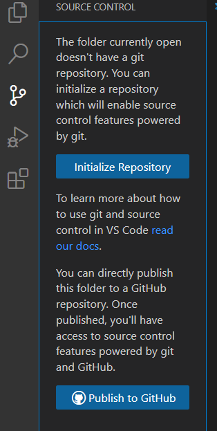

- Then you can rename the repository as you want to and chose whether it’s a public or private repository :

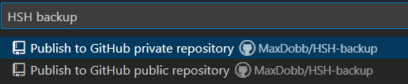

- Simply follow the procedure with the pop-ups from github.

Once you have selected which files you are about to push and commit to your private github repository, please head over to the .gitignore on the left-hand side and input the file formats to ignore

These specific file formats depending on the coding language can be found here : https://github.com/github/gitignore

- Once the ignored files are set, you can commit and push the files
- This process will add the files in your repository on GitHub

### Once this is done, you can commit new changes and preview them whenever you want it to

- Before committing new changes, add a message in the ‘message’ area on top of “commit” on the left-hand side of the VSCode tab
- If you don’t, a pop-up will show up, simply click “yes”

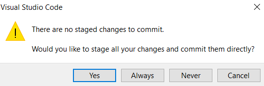

- Then state your message (1) and accept (2)

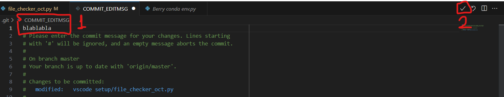

- The preview will be in red for the old version and green for the new updates

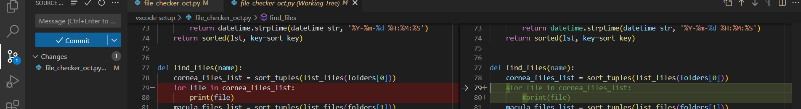

This will directly commit the changes from your local files to your designated github repository