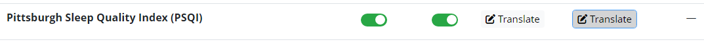
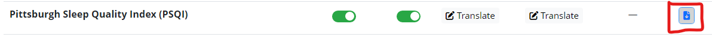
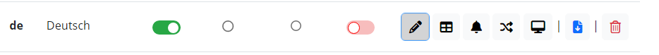
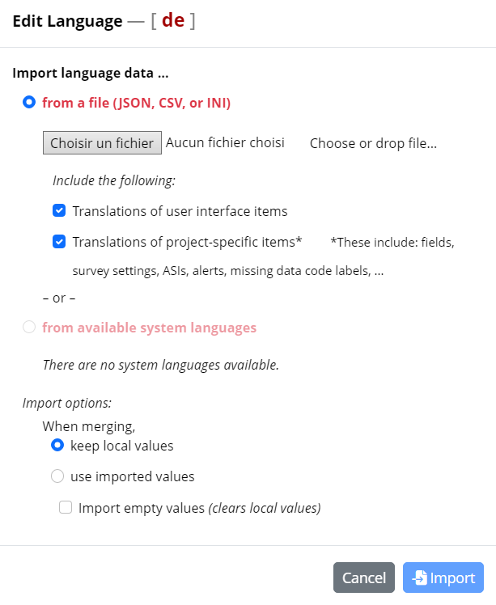

# How to RedCap - Basis & FAQ

This How To describes the standard workflow when working with RedCap in the lab and, lab standards in setting up and translating RedCap surveys.

## Before starting

1. Make sure you have access to MPI/TUM Project Template

   

2. Make sure you have access to the RedCap channel
   1. to discuss questions
   2. to ask if someone has implemented a survey beforehand
   3. to ask for reviews / translations
   4. to share newly set up variables

## New survey

- Variable names
  - Conventions for coding of variables can be found here: [https://docs.google.com/spreadsheets/d/1HO_OZBSEFg38lUpPxdW0KE-TZeaDmJH14Zpz2bJ_V5Q/edit#gid=576324485](https://docs.google.com/spreadsheets/d/1HO_OZBSEFg38lUpPxdW0KE-TZeaDmJH14Zpz2bJ_V5Q/edit#gid=576324485)
  - Variables should contain the name of the survey at the beginning(e.g. time variable in MCTQ could be mctq_time)
  - Don’t use capital letters, only lower letters
  - Use underscore(”\_”) to seperate words
- Gender-neutral language
  - For unspecified gender, use “they” instead of e.g. “she / he”

## Translations

### Import languages

- For a whole project
  - Go to the project from which you want to export the translations
  - Go to “Multi-Language-Management” on the sidebar on the left
  - Go to “Languages”
  - Below the “Add a new language” button you can see the languages that are already added to the project. Find the language you want to export and press the blue export button
  - You should get options to choose which translations you want to import and which format you want to use. After choosing your preferred options press the green “Download” button(Note: after finishing this step you should have downloaded a file that contains the information about the translations)
  - Go to the project you want to import the language into
  - Go to “Multi-Language-Management” on the sidebar on the left
  - Go to “Languages”
  - Press the green “Add a new language” button(If you have already added the language you can press the edit button, which is a black pencil, close to the given language)
  - Press the “Import from file or system” button
  - Choose the file you have imoported from the other project and press the blue “Import” button
- For a specific survey within one project

  - start by going to multi language management
  - select a “study” and modify its translations (don’t forget to save)
    
  - download the file in a json format at the very right of the line

    

  - Go to your redcap study page
  - go to multi language management
  - select a language you want to modify and go on “edit language”
    
  - Import the previously json file saved
    
  - Apply the changes, the translations will be added to your language module.

### German translations

- Use ChatGPT and Deepl for translations
  - Do not translate things yourself
  - Correct the AI-generated languages so they match the purpose of the question
  - Let another Lab member check the translations (you can tag someone in the slack channel “redcap”)
- Gender-neutral language
  - Use “Gender Doppelpunkt” for gender-neutral languate, e.g. “der:die Versuchsleiter:in”

## Save and export surveys as PDF

- At "Multi-Language Management", set the Default Language to the one you want to export.
- Go to "Designer", and in the Overview under "View PDF" click on the PDF button to export the survey in this specific language
- Make sure to reset the Default Language to English under "Multi-Language Management"
