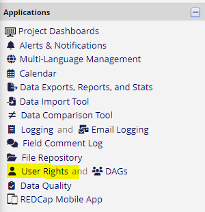
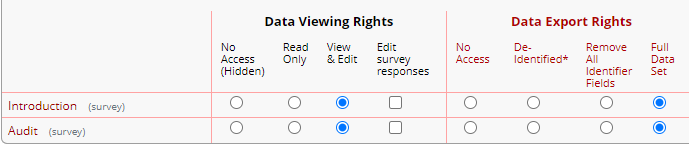
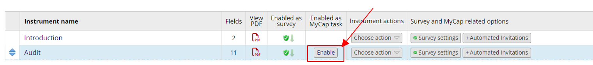
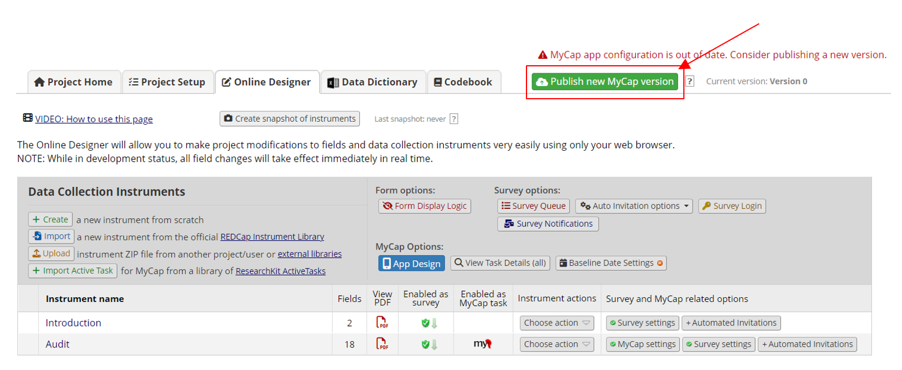

# How to RedCap

## MyCap

- Take care of:
    - It’s not possible to change languages. If you want to have your survey in German as well you have to set up an extra survey.
    - If you decide to not use MyCap anymore, you have to delete the extra fields it creates for you
- User rights
    - Even though you maybe created an own project that doesn’t mean that you have all the rights. If you really want to be able to do everything needed on RedCap you have to give yourself (/ or the person who is allowed to do that gives you) all the rights to edit the surveys.
    - Go to “User Rights”
    
    
    
    - click on your name → “Edit user privileges”
    - On the left side you scroll down and enable “Rename Records” and “Delete Records”, on the right side the settings should look like this (optional also “Edit survey responses”
    
    
    
    - Now you have all the nescessary rights
- Setting Up MyCap (RedCap):
    - Go to Project Set Up → Main project settings
    - Enable ‘Use the MyCap participant-facing mobile app?’
    - Wait until administrator gives you the rights
    - Go to Designer
    - You have to add a new instrument as a first one(e.g. Introduction) (MyCap needs one survey in the beginning which it doesn’t include in the App)
    - A new column will show up where you can enable the survey as a MyCap task
    
    
    
    - RedCap will tell you that it has to add fields for MyCap, they will not be seen by the participants (don’t forget to delete them when you decide disable MyCap again)
    - You can fill out the settings (especially the task schedule settings) → save
    - very important! everytime that you change something you have to press the green button “Publish new MyCap version”. Without that you will have no survey in the app and no changes will be transported
    
    
    
    - You also have a new field now on the left side called “MyCap Participant Management”
- Adding a new Participant for MyCap
    - Go to “Add/Edit records” → “Add new record” → pick the additional survey (that you maybe also called Introduction) → you can select complete but you dont have to → Save & Exit form
    - If you want the record to have another name, click on “Add/Edit records” and select the record ID that you want to change the name of
    - Click on “Choose action for record” → select “Rename record”
    - If there is no option to do this you have to enable all the user rights (look in User Rights in above)
- Things important for MyCap App
    - Download from Playstore possible
    - If there is no survey appearing then you probably forgot to update the survey to mycap
    - You can change the design of the app in RedCap in “App Design”
    - Notifications will appear once a day (at 8am) and it is not possible to change the notifications
    - Because Mycap cannot understand textfields, you have to add multiply choice field (maybe just ask if they want to continue)
    
- How to delete records
    - first you need the user rights for removing data
    - go to “Add/Edit” records
    - choose the record you want to delete
    - “choose action for record”
    - “delete record”
    - you can still delete records in production mode, also when going into production mode you will be asked if you want to delete all records. But this wont work reliably. Take care that all your trial records are deleted before you start the real survey