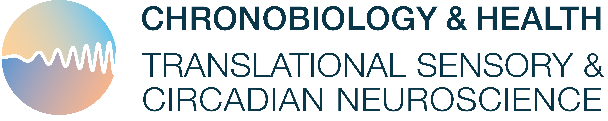

# Lab Handbook

This is the Lab Handbook of the Integrated Research Group between the Max Planck Research Group *Translational Sensory & Circadian Neuroscience* at the Max Planck Institute for Biological Cybernetics and the Professorship of Chronobiology and Health at the Technical University of Munich.

## Contributing

To contribute to this book, please have a look at the [how to](./how-tos/document-on-github/main.md.
