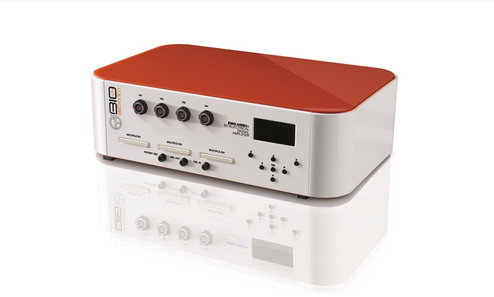
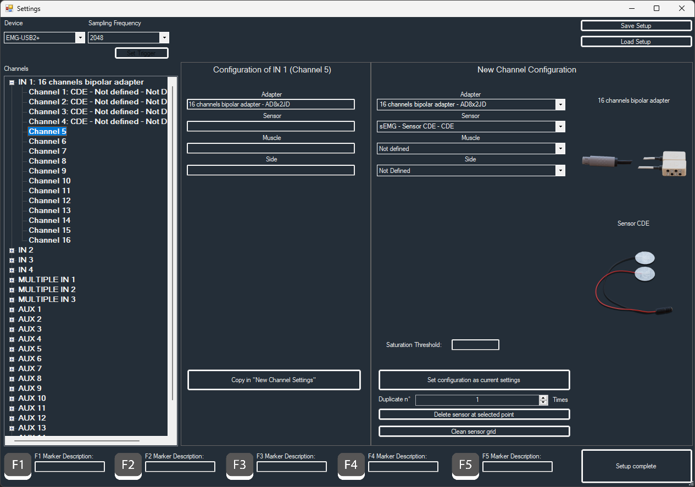

# Standard Operating Procedure for OTBioelettronica EMG-USB2+ device

| Device       | OTBioelettronica, EMG-USB2+ bioelectrical signal amplifier                                              |
| ------------ | --------------------------------------------------------- |
| Objective    | Measuring muscle activity on the skin (sEMG)                    |
| Owner        | [Lucien Bickerstaff](mailto:lucien.bickerstaff@tuebingen.mpg.de) |
| Reviewer     |  |
| Approver     |  |
| Contributors | [Lucien Bickerstaff](mailto:lucien.bickerstaff@tuebingen.mpg.de) & [Veronica Canziani](mailto:canzianiveronica@gmail.com) |
| Version      | 1.0.0                                        |
| Last edit    | [Lucien Bickerstaff](mailto:lucien.bickerstaff@tuebingen.mpg.de) |
| Date         | 20250205                                                  |

## Manuals

All devices and software manuals for the device and software used can be accessed at https://otbioelettronica.it/en/download/.

## Start up

- Checklist for materials
  1. EMG-USB2+ amplifier 
   
      
  2. ECG/EMG electrodes (currently using 30x24 mm) 
   
      
  3. EMG bipolar sensors
   
      
  4. EMG adaptor

      
  5. Software: [OTBiolab+](https://otbioelettronica.it/en/software/)
  6.  Software: OTBiolab Light (installed with OTBiolab+)
  7.  Optional: 
     - Skin prep (Nuprep or equivalent) and gauze / paper towels
     - Tape
  
- Start up system
  1. Turn on device: small button at the back, on the left-hand side 

      
  2. Connect USB cable

      
  3. Start software:
     - OTBiolab+ for normal, standalone measurements
     - OTBiolab Light for measurements using 3rd party software (e.g., Python scripts)
  4. Connect the electrodes to the amplifier:
     1.  Connect the extension cable with the bipolar sensors
     2.  Connect the sensor unit to the adaptor
       - Careful to plug the sensor unit into the right channels: numbers are labelled on the adaptor
     3.  Connect it into the amplifier(you would typically want to use _IN1_)
     4.  Connect the ground electrode in the _PATIENT REF_ input

      

## Preparation

- OTBiolab+:
  1. Go to: _Acquisition/Setup_
  2. In the _Channels_ panel on the left-hand side:
     1. Select and unfold _INx_
     2. Select the channel you want to set up
  3. In the _New channel configuration_ panel on the right hand-side:
     1. Set _Adapter_ to “16 channels bipolar adapter – AD8x2JD”
     2. Set _Sensor_ to “sEMG - Sendor CDE - CDE”
  4. Press _Set configuration as current settings_. You should then see your settings in the _Configuration of INx (Channel x)_ panel
  5. Repeat steps 2.2, 3.1 and 3.2 for each channel that you want to measure
  6. Press _Setup Complete_ to save your setup settings 

_NOTE: This configuration can be saved in OTBiolab+, so it does not need to be set up before each trial. So, as long as the number of channels in use remains the same, you only need to do this once. Or you can open the saved setup file and then edit it. You can also copy the current configuration and paste it to add new channels faster._

- OTBiolab Light:
  1. Make sure OTBiolab+ is closed! Both software cannot run simultaneously
  2. Set the correct settings: 
     - _Device_: "EMG-USB2+"
     - _Channels_: "256+16"
     - Rest is up to you
  3. Click _Start_ to initiate connection with device
     - There should be a prompt: _Acquisition started – don't close OTBiolab Light_ 
  4. The rest should be handled by your own software

## General Procedure

Placing electrodes:
  1. If needed, gently apply skin prep gel to skin surface with the gauze (careful not to rub too much – gel is abrasive!)
     - In theory, the measured area must be shaved beforehand – even if there are no visible hair 
  2. Place electrodes 
     - Don't forget ground electrode! Can placed on the forehead near the hairline, on the elbow, behind the neck… Basically wherever no muscle / electrical activity occurs
  3. Plug the cables to the electrodes
     - Careful to make sure to match (or take note of) the channel numbers and the right muscle you want to measure
  4. Tuck cables away, to make sure no cables obstruct participant therefore ensuring good data. 
     - For this you can use the tape - make sure there is no snagging or tension on the cables and the participant is comfortable
  5. If you want, you can secure the electrodes even more with a small amount of tape over each one.

_NOTE: if the signal does not look to be changing as the participant performs different movements, check that all electrodes, especially the black “ground” electrode, are on correctly and still pasted onto the skin._

Recording from OTBiolab+:
  1. Click on the green play button in the top panel to start visualisation. Use the double arrow symbol in each channel panel to scale the signal.
  2. Check that the channels are properly connected
     - Ask participant to move the measured muscle(s), you should be able to visualise changes in each channel throughout the different movements
  3. Click on _Start recording_ (red button)
  4. Click on _Stop recording_

## Experiment Procedure

### Measurement A: facial sEMG

| Description | Link to variation                                      |
| ----------- | ------------------------------------------------------ |
| PSR Project   | [PSR project measurement A](#measurement-a-in-psr-project) |

A list of all facial muscles theoretically measurable is visible below (from: Kovalchuk, Y.; Budini, E.; Cook, R.M.; Walsh, A. Investigating the Relationship between Facial Mimicry and Empathy. Behav. Sci. 2022, 12, 250. https://doi.org/10.3390/bs12080250)

Placing electrodes:
1. Place electrodes on the desired muscles
2. Carry out some skin prep – depending on amount of sweat, skin oils, etc.
3. Electrodes might be in sensitive areas – if too hard, let participants plug the electrodes themselves by helping them find the location of the electrode and letting them do the rest
4. Make sure electrodes stick well, especially for individuals with beards – muscles such a the orbicularis oris may be hard to capture then
   - Use tape if needed
5. Tuck the cables around the ears – you can also twist the plugs on the electrodes so the cables come out in a convenient way
6. Use tape on the shoulder to keep the cables in place – no pulling, but no loose cables also!

### Measurement B

_No other variations recorded yet_

## Data Saving

- After recording
  1. _File/Save_ to record your data as a .otb file 
     - Visualise and process data within the software if needed

- Access saved data 
  1. _File/Open_ to open recorded .otb files

| Description | Link to variation                                              |
| ----------- | -------------------------------------------------------------- |
| PST Project   | [PSR Project storage transfer](#storage-transfer-in-psr-project)   |

## Shut down

OTBiolab+:
  1. Close the window to stop the software:
   - If the system isn't recording and data has been saved!

OTBiolab Light:
  1. Click on _Stop_
     - There should be a prompt: _Acquisition stopped_
  2. Close the window to stop the software:
   - If the system is recording, acquisition will stop as if you clicked on the stop button – there should be the same prompt: _Acquisition stopped_!

Hardware:
  1. Press on the button at the back of the amplifier to turn it off

---

## Project specific measurements

### Measurement A in PSR Project

In the PSR project, the following muscles are of interest to measure light sensitivity:
- Orbicularis oculi
- Corrugator supercilii
- Zygomaticus major
- Orbicularis oris
  
The layout of the muscles is as follows:

## Storage transfer in PSR Project

In the PSR project, the data is recorded and saved as a .csv file using a custom Python module (link to code yet to be added – ask [Lucien Bickerstaff](mailto:lucien.bickerstaff@tuebingen.mpg.de) if interested)
