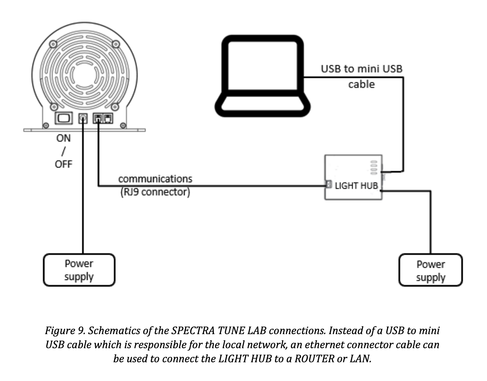

# Standard Operating Procedure for Spectra Tune Lab light source

| Device       | Ledmotive, Spectra Tune Lab 10-primary LED light engine                                              |
| ------------ | --------------------------------------------------------- |
| Objective    | Producing spectrally tuneable light                    |
| Owner        | [Lucien Bickerstaff](mailto:lucien.bickerstaff@tuebingen.mpg.de) |
| Reviewer     |  |
| Approver     |  |
| Contributors | [Lucien Bickerstaff](mailto:lucien.bickerstaff@tuebingen.mpg.de) |
| Version      | 1.0.0                                        |
| Last edit    | [Lucien Bickerstaff](mailto:lucien.bickerstaff@tuebingen.mpg.de) |
| Date         | 20250207                                                  |

## Manuals

The manual for the device used can be accessed on this repository [here](./manual/DS_450003_rev06_SPECTRA-TUNE-LAB.pdf).

## Start up

- Checklist for materials
  - Hardware:
    1. Light source:

        

    2. Light Hub:

        

  - Software:
    1. µWave software (can be installed on Windows machine from the provided USB stick:

        

    2. PyPlr package, if communication through Python necessary. It has a ```pyplr.stlab``` module for handling many STLab features.

         Access the documentation at https://pyplr.github.io/cvd_pupillometry/07_api.html#pyplr-stlab.

         Martin, Joel, T., & Spitschan, M. (2021). PyPlr (1.0.0). Zenodo. https://doi.org/10.5281/zenodo.6724918
  
- Start up system
  1. Connect the device: make sure the light source is connected as follows (from the manual):

      

  2. Turn on device: power button at the back of the device
  3. Start software, either:
     - µWave – user-friendly, GUI based 
     - Python for more control through PyPlr

_NOTE: The workshop built a nice little holder for placing ND filters at the front of the device. Make sure that the ND filter is not under pressure from overtightening the screws. When you change the filter, unplug the light source. Nothing will hold the filter from falling when you unscrew the holder – be extra careful to hold the light source upright._

  

## Preparation

µWave software:
1. Click on _Connections_ in the top panel
2. Click on _Re-scan_ to look for light sources
   - You should see the two addresses – 1 and 1023. Both should work
3. Then you can start playing with the light source.

PyPlr:
1. Establish the connection to the light source. Make note of the device password accessible from the provided USB stick.

   ```light_source = SpectraTuneLab(username='admin', default_address=1023, password='*')```
      
   _TIP: Send all commands to address 1023, not 1 – this has caused issues with playing the command properly – some weird priority thing. Basically, 1 is the device address and 1023 is the broadcast address. When you connect one of the devices it gets assigned an address between 0 - 1022. The broadcast address is a special address that will target all devices in the network._

2. The rest is up to you, depending to what you want to do – refer to the PyPlr documentation.

## General Procedure

- PyPlr: how to play a simple light stimulus?

   The light source has 10 LEDs, each taking an intensity value ranging from 0 (dark) to 4095 (maximum intensity).
   You have to pass a list of 10 intensity values to the light source.

   ```
   spectrum = [300]*10 # Create the list of settings – 1 value for each LED
   light_source.set_spectrum_a(spectrum) # Pass it to the light source
   sleep(2.) # Wait for two seconds
   light_source.turn_off() # Swtich the lights off
   ```

   This is just one of the many ways to control the light source! Refer to the PyPlr documentation for more in-depth info.

## Experiment Procedure

### Measurement A: using video files

| Description | Link to variation                                      |
| ----------- | ------------------------------------------------------ |
| PSR Project   | [PSR project measurement A](#measurement-a-in-psr-project) |

In the PSR project, the light source is controlled with PyPlr.
Sequences of 30-second light stimulation are played using so called .dsf video files (essentially .json files).
This allows to program the different commands to send to the light source beforehand.

For more info, ask [Lucien Bickerstaff](mailto:lucien.bickerstaff@tuebingen.mpg.de).

### Measurement B

_No other variations recorded yet_

## Data Saving

_No data saving_

| Description | Link to variation                                              |
| ----------- | -------------------------------------------------------------- |
| PST Project   | [PSR Project storage transfer](#storage-transfer-in-psr-project)   |

## Shut down

1. Software:
   
   µWave:
   - Simply close the window.

   PyPlr:
   - You can pass a command to stop light emission. To my knowledge there is no way to properly disconnect from the light source.

      ```light_source.turn_off()```

2. Hardware:
   - Press on the button at the back of the light source to turn it off.

---

## Project specific measurements

### Measurement A in PSR Project

In the PSR project, a need for a gradual ramp-up and ramp-down in the sequences led to creating a variation of the ```pulse_protocol``` function to handle this specific need.
The video files are created and then stored in a _resources/video_files_ folder, for later access for light sequence playback.

For more info, ask [Lucien Bickerstaff](mailto:lucien.bickerstaff@tuebingen.mpg.de).

## Storage transfer in PSR Project

_No data saving_
