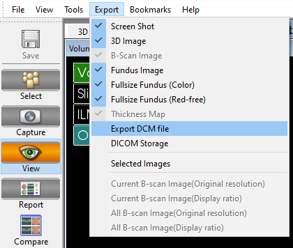
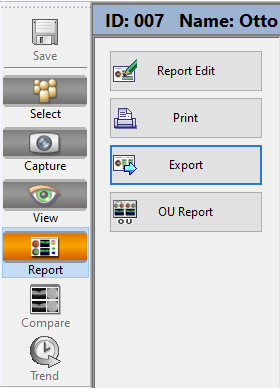
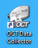

| Device       | Topcon 2000 OCT                                                 |
|--------------|-----------------------------------------------------------------|
| Objective    | Measuring ocular physiology                                     |
| Owner        | [Hannah S. Heinrichs](mailto:hannah.heinrichs@tuebingen.mpg.de) |
| Reviewer     |                                                                 |
| Approver     |                                                                 |
| Contributors | [Hannah S. Heinrichs](mailto:hannah.heinrichs@tuebingen.mpg.de) |
| Version      | 1.0.0                                                           |
| Last edit    | [Hannah S. Heinrichs](mailto:hannah.heinrichs@tuebingen.mpg.de) |
| Date         | 11.11.2022                                                      |

# Start up

* Checklist
    1. OCT device
    1. Distance holder for forehead
    1. Desktop PC is connected
    1. Desinfecting cloths

* Start up system
    1. Turn on Power under table and on the side of OCT
    2. Start up Computer
    3. Open Program OCT
    4. Register new participant with ID
    5. Open “Capture”
    6. Start general followed by specific procedures

# General

1. Desinfect the chin rest
1. Invite participant to take a seat.
1. Switch off light
    > _I am now going to switch. Are you ready for the experiments or do you have any questions?_

    > _Ich werde jetzt das Licht ausschalten. Sind Sie bereit für die Messungen oder haben Sie noch fragen?_

1. Press “Capture” in Software
2. Adapt table
3. Adapt chin rest (eyes on height of mark)
4. Participant instruction (EN/DE):
    > _We will take X different images. For each image please focus either in the middle or at the green square._

    > _Wir werden verschiedenen Bilder aufnehmen. Schauen Sie währenddessen bitte entweder in die Mitte oder auf das grüne Quadrat._

# Procedure pre-experiment data collection

## Corneal thickness  (pre-session)

1. Setup
    1. First put distance holder to forehead
    2. Select “ANTERIOR > Radial Anterior Seg.”
    3. Select “Color” → *no* Fundus photography
2. Get image
    1. Right image: 
        1. Horizontal line in the middle of the pupil and at pupil reflex
    2. Left image: 
        1. Horizontal line AND vertical line (light relex) should be in yellow square
3. Press button to take image

## Fundus photography (pre-session)

1. Setup
    1. No distance holder
    2. Select “FOTO > Fundus Photo”
    3. Select “ON S. Pupil”
    4. Select “C Fix. Pos”
2. Instruction:
    1. “Please focus on the green square”
3. Move into the pupil until you see the fundus
4. Press button to take image

# Procedure during experiment

## Macula image

1. Setup
    1. No distance holder
    2. Select “MACULA > **3D Macula 6.0x6.0**” (2. button)
    3. Select “ON S. Pupil” → corrects for small pupil
    4. De-select “Color” → *no* Fundus photography
    5. De-select OCT-LFV → no overlay image
2. Instruction
    1. “Please focus at the green square”
    2. right eye: “you may have to look a little bit to the left”
3. Position square at middle of pupil, find 2 white dots
    1. screw joy stick for up-down-movement
    2. horizontal line on pupil reflex
4. Move in with body until you see back of fundus
5. And find 2 dots gain → move into brackets
    1. check and adapt illumination
    2. adjust *slightly* with joy stick 
    3. move further into eye to focus bring points together
6. Align 2 rectangles should be on top of each other
    1. Press [Optimize]
    2. Adjust with wheel on right side further
    3. De-select OCT-LTF (ged rid of overlay)

## Optic disc image

1. Setup
    1. No distance holder
    2. Select “GLAUCOME > 3D Disc”
    3. Select “ON S. Pupil” → corrects for small pupil
    4. De-select “Color” → *no* Fundus photography
    5. De-select OCT-LFV → no overlay image
2. Get image
    1. Pupil in the middle of the *red* square
    2. Pupil reflex should be in the middle of brackets
    3. Move into the pupil until you see optic disc
    4. Find 2 bright dots, bring them together
    5. Align 2 rectangles
        1. with wheel on the right
        2. press [Optimize] button
    6. Check bar for image quality should be > 50, quality of < 45 can’t bu used. 
3. Press button on joy stick to **take image**
4. Image quality control (QC)
    1. Excavation must be down, otherwise you were too far in

## Corneal thickness

1. Setup
    1. First put distance holder to forehead
    2. Select “ANTERIOR > Radial Anterior Seg.”
    3. De-select “Color” → Fundus photography
2. Get image
    1. Right image: 
        1. Horizontal line in the middle of the pupil and at pupil reflex
    2. Left image: 
        1. Horizontal line AND vertical line (light relex) should be in yellow square
3. Press button to take image

# Data Saving at OCT

Routine to save data.

- [ ]  Transfer to Server

## Requirements (may be skipped)

- OCT Data Collection Software
    - can be found here:
        
        [HiDrive.zip](img/HiDrive.zip)
        
    - To download, unzip files
    - Go to “HiDrive” > “OCTDataCollectorInstaller”…
    - Install software on windows by clicking “OCTDatacollectorInstaller.msi”
    - The programm will be linked on the desktop

## 0. Have a look at the Manual

- Manual:
    
    [OCTDataCollector Instruction.docx](img/OCTDataCollector_Instruction.docx)
    

## 1. Save DICOM and PDF output

**The OCT machine has to be on in order to access the software on the computer** 

1. In the **3DOCT GUI**, click on the participant and select one of the three different measurement output (Macula, Disc, Anterior)
2. For each of the measurement….
    1. Click on “View” in the side pane
        1. On the menu bar go to “Export” > “Export DCM file”, save file as specified.
            
            
            
        2. Click on “Report” on the side pane and the “Export” button, save file as specified
            
            
            
    
    You can chose the folder when saving files, please be careful to export the files in the right folder. 
    
    When saving files, please respect this template : 
    C:\test_oct
     - **macula**
    	 - *data*
    			- .csv files
    	 - *dicom*
    			- .dcm files
    	 - *img*
    			- .pdf files
     - **disc**
    	 - *data*
    			- .csv files
    	 - *dicom*
    			- .dcm files
    	 - *img*
    			- .pdf files
     - **cornea**
    	 - *data*
    			- .csv files
    	 - *dicom*
    			- .dcm files
    	 - *img*
    			- .pdf files
    

## 2. Save CSV file with OCT data

1. Open the the OCT Data Collector program
    
    
    
2. As Data folder select: `D:\3DOCT\data` 
3. Press “Search” → in folder the .fda files are stored. Die FDA files contain all relevant information.
4. Follow the instructions given by the following Manuel (download docx from above) and consider:
    1. Reference data:
        1. Select: `D:\3DOCT\data` in which the .fda files are stored. Die FDA files contain all relevant information.
        2. Select MACULA, DISC and EXTERNAL (for cornea) files of the participant so that they appear in the table
    2. Export File
        1. Save data in the following folder `C:\Users\mspitschan-admin\Documents\oct_data`
        2. As prefix specify date and time in the following format `[YYYYMMDD]_[HHMMSS]_[ID]`

### Check complete files

1. Check if CSV files have been saved
    1. 4 .csv files must have been create with the following format:
        1. `[ID]_[YYYYMMDD]_[HHMMSS]_3D_DISC.csv`
        2. `[ID]_[YYYYMMDD]_[HHMMSS]_3D_MACULA(6x6GRUD).csv`
        3. `[ID]_[YYYYMMDD]_[HHMMSS]_3D_MACULA(ETDRS).csv`
        4. `[ID]_[YYYYMMDD]_[HHMMSS]_3D_ANTERIOR.csv`
    
2. Check if DICOM and PDF have been saved
    1. 8 .dcm files and 6 .pdf files in different folders, one for each of the measurements (please respect the following template when saving files) :
        1. cornea
            1. data
                1. `oct__3D_ANTERIOR.csv`
            2. dicoms
                1. `[ID]_[YYYYMMDD]_[HHMMSS]`_OP_R_001.dcm
                2. `[ID]_[YYYYMMDD]_[HHMMSS]`_OP_L_001.dcm
                3. …
            3. img
                1. `[ID]_[YYYYMMDD]_[HHMMSS]`_OCTReport_R_001.pdf
                2. `[ID]_[YYYYMMDD]_[HHMMSS]`_OCTReport_L_001.pdf
                3. …
        2. macula
            1. data
                1. `.csv`
            2. dicoms
                1. `[ID]_[YYYYMMDD]_[HHMMSS]`_OP_R_001.dcm
                2. `[ID]_[YYYYMMDD]_[HHMMSS]`_OP_L_001.dcm
                3. `[ID]_[YYYYMMDD]_[HHMMSS]`_OPT_R_001.dcm
                4. `[ID]_[YYYYMMDD]_[HHMMSS]`_OPT_L_001.dcm
                5. …
            3. img
                1. `[ID]_[YYYYMMDD]_[HHMMSS]`_OCTReport_R_001.pdf
                2. `[ID]_[YYYYMMDD]_[HHMMSS]`_OCTReport_L_001.pdf
                3. …
        3. disc
            1. data
                1. `.csv`
            2. dicoms
                1. `[ID]_[YYYYMMDD]_[HHMMSS]`_OP_R_001.dcm
                2. `[ID]_[YYYYMMDD]_[HHMMSS]`_OP_L_001.dcm
                3. …
            3. img
                1. `[ID]_[YYYYMMDD]_[HHMMSS]`_OCTReport_R_001.pdf
                2. `[ID]_[YYYYMMDD]_[HHMMSS]`_OCTReport_L_001.pdf
                3. …

## 3. Transfer to Server
... 

# Shut down

1. Shut down OCT and PC
2. Clean chin rest
3. Put on cap on the lens of the OCT
4. Put on cover for dusk protection
5. Turn off energy device under the table
1. Turn on Power under table and on the side of OCT
2. Start up Computer
3. Open Program OCT
4. Register new participant with ID
5. Open "Capture"
6. Start general followed by specific procedures

