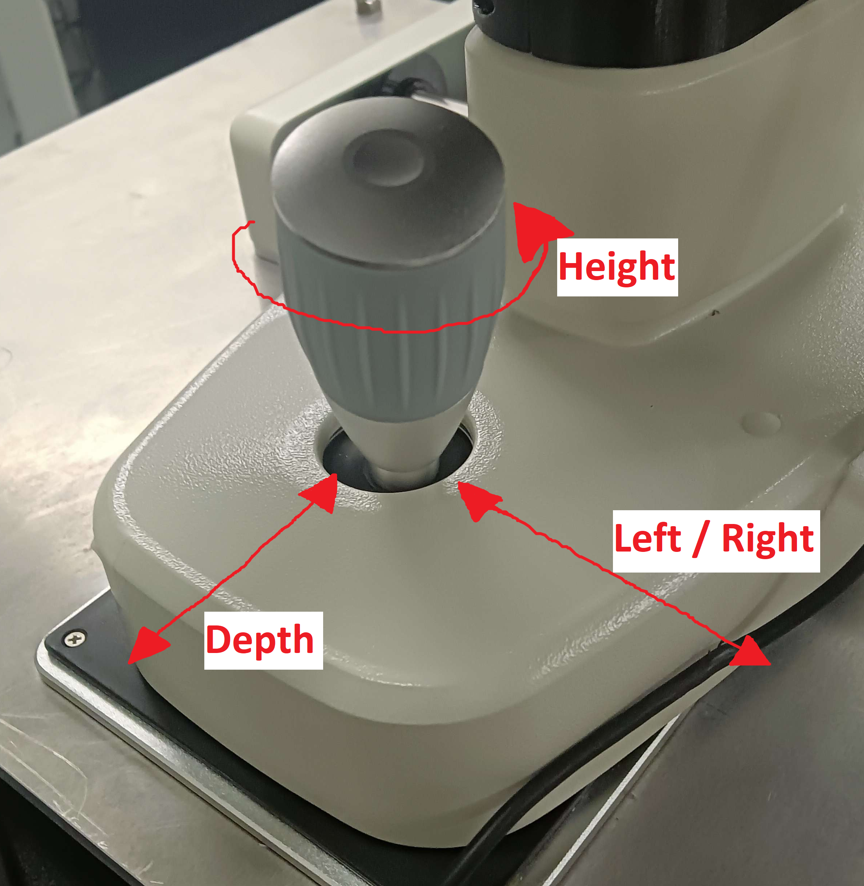

# Standard Operating Procedure for NVBL

### Start up system

1. Switch on device
2. Start experimentor computer
3. Connect both with USB cable
4. Start up RetinaWise software

# Procedure with participants

1. Participants are seated in front of the device
2. Adapt chair height, table height and chin rest → eyes are on the height of lenses

   > **\*\***\*\*\*\***\*\***Please keep your hands on your lap (and not on the table)**\*\***\*\*\*\***\*\***

3. Instruct participant

   > _Please set your eyes as if you were staring into infinity (or at a horizon). A green light will appear later on, keep looking into the horizon when it happens.
   > Please only answer by tapping the table once for yes, twice for no, avoid speaking as it moves the eyes as well._

4. Adjust cameras

   1. Always start with right eye :
      - Move the camera with the handle to adapt height (up or down)
      - Then move (left or right) to put the yellow dot around the middle of the pupil
      - Adapt depth (back and forth) to align the alignment camera
      - Repeat steps above if the yellow dot derives from the pupil center

   

   <aside>
   💡 Do not fix the NVBL device too hard as you might have to adapt during recording (left / right and height mostly)

   </aside>

   1. Proceed to align the left eye
      - Use the big screw on the right-hand side to align the left eye

5. Press “Align patient”

   1. Ask the patient if they see the

   > _Can you see coloured circle with both eyes. Only answer with a noise or a tap._

   1. Adjust cameras to make sure the circle is visible with \***\*both\*\*** eyes, if necessary

      - Ask the participant if the “light disk” is sharp

      > _Tell me when you see the circle’s edges sharply. Only answer with a noise or a tap._

      - if not: turn the two “screws” (coming straight out of the cameras) on the back of the device to adjust sharpness

      

   2. Fine-tuning cameras so left and right pupils are clearly detected (circled in red with the yellow circle in the middle)
   3. Press the button “Align participant” again to leave the menu and stop the light stimulus

6. Switch light off
7. Load protocol
   1. Select Excel file with the protocol with participant ID
8. Select “Start sequence”
   1. Protocol running
9. Check if files have been saved in the NVBL results folder.
