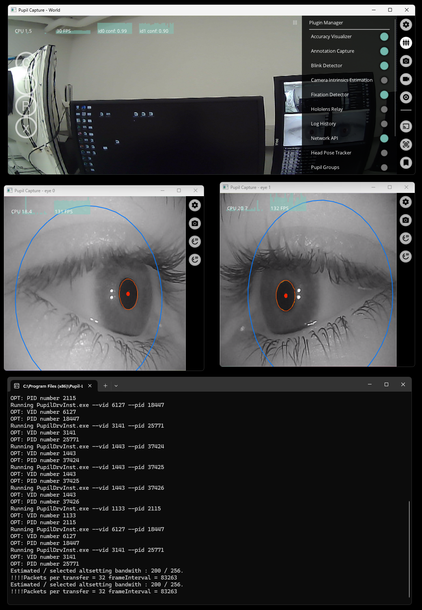
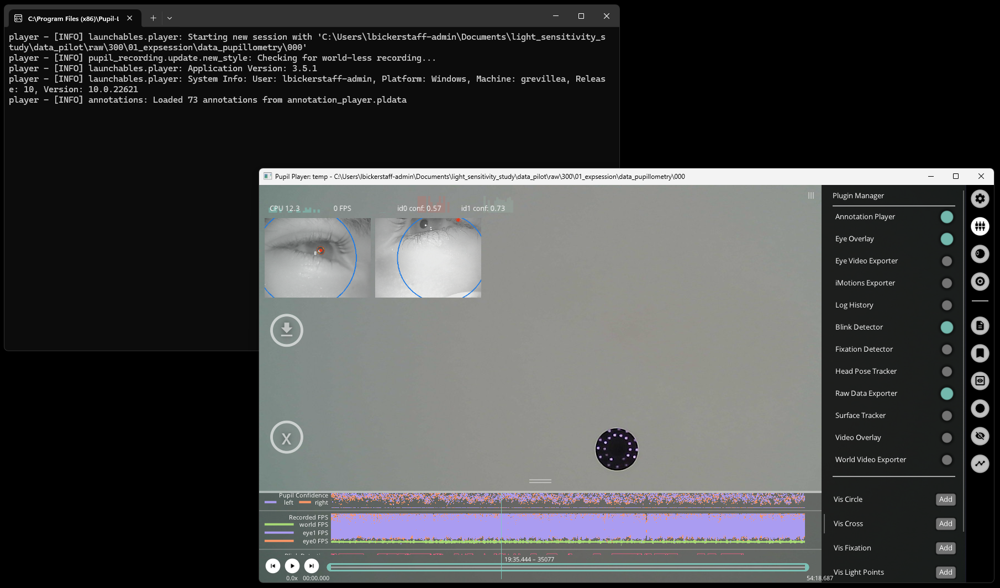

# Standard Operating Procedure for Pupil Core eye tracking device

| Device       | Pupil Labs, Pupil Core eye tracking system                       |
| ------------ | ---------------------------------------------------------------- |
| Objective    | Measuring eye activity (pupil size, blinks, gaze…)               |
| Owner        | [Lucien Bickerstaff](mailto:lucien.bickerstaff@tuebingen.mpg.de) |
| Reviewer     |                                                                  |
| Approver     |                                                                  |
| Contributors | [Lucien Bickerstaff](mailto:lucien.bickerstaff@tuebingen.mpg.de) |
| Version      | 1.0.0                                                            |
| Last edit    | [Lucien Bickerstaff](mailto:lucien.bickerstaff@tuebingen.mpg.de) |
| Date         | 20250205                                                         |

## Manuals

All devices and software manuals for the device and software used can be accessed at https://pupil-labs.com/products/core.

## Start up

- Checklist for materials
  1. Hardware: [Eye tracker](https://docs.pupil-labs.com/core/hardware/)
  2. Software: [Pupil Capture](https://docs.pupil-labs.com/core/software/pupil-capture/)
  3. Software: [Pupil Player](https://docs.pupil-labs.com/core/software/pupil-player/)
- Start up system
  1. Plug in hardware into computer USB port
  2. Start software (Pupil Player – round shaped icon). 4 windows should open:
     - A console
     - Camera feedback:
       - One main window for the "world" camera (front facing RGB camera)
       - Two windows for each eye (IR cameras)
  - If the software won't load properly (only the console is open), close the console, unplug and replug the eye tracker, and start the software again

## Preparation

Software:

1. Go the the _plugins_ panel on the right-hand side and select all the plugins you need (e.g. _Blink detector_, _Annotation capture_)
2. Check other panels for more settings (including _general_ for output recording directory)
   - Depending on what the focus is for the measurements, certain plugins may be activated/deactivated
3. If the eye cameras are well adjusted, the pupil detection confidence values (small metrics at the top of the main window, one for each eye) should be close to 1 (i.e., 100% confidence in the measurements) at all times

## General Procedure

1. Put the eye tracker on participant
2. Adjust the eye cameras so that they detect the pupil perfectly, and that the whole eye is in the image
   - For more precision, ask the participant to squint a bit and adjust accordingly. The aim is that the pupil is still detected when squinting, and not hindered by eyelashes
3. Ask participant to look around – left, right, top, bottom – for a good 10 to 20 seconds. The aim here is to give enough information to the software to create an accurate 3D model of the eye, allowing for accurate pupil measurements
   - The outline of the model in the eye camera windows should be dark blue, not sky blue!
4. At this point, you can choose to freeze the eye model by going into the parameters of each of the eye camera windows and turning on _Freeze model_.
   - This will avoid the software continuously adapting the eye model during recording, creating more stable data – provided there is little head / device movement during the whole recording! Then the measurements will be inacurate.
5. In the software, click on the big _(R)_ button on the left-hand side of the main window to start a recording
6. Click on that same _(R)_ button to stop the recording

_See screenshot above for example_

## Experiment Procedure

### Measurement A

| Description | Link to variation                                          |
| ----------- | ---------------------------------------------------------- |
| PSR Project | [PSR project measurement A](#measurement-a-in-psr-project) |

The measurements are made through PyPlr, as Python package that has a module for recording using Pupil Core: Martin, Joel, T., & Spitschan, M. (2021). PyPlr (1.0.0). Zenodo. https://doi.org/10.5281/zenodo.6724918

Focus is set on measuring pupil responses like the Pupillary Light Reflex (PLR) or the Post-Illumination Pupil Response (PIPR).
The following plugins may then be activated:

- Blink detector
- Annotation capture

Then, for communicating within Python, look at the PyPlr documentation: https://pyplr.github.io/cvd_pupillometry/07_api.html#pyplr-pupil.

Ask [Lucien Bickerstaff](mailto:lucien.bickerstaff@tuebingen.mpg.de) if you need help with this!

### Measurement B

_No other variations recorded yet_

## Data Saving and Exporting

Data is saved automatically in Pupil Capture after stopping recording.

- Access and export saved data
  1. Start Pupil Player software (triangle shaped icon)
  2. Find the directory of your pupillometry recording – folder is likely named _000_
  3. Drag this folder into the Pupil Player window
  4. Activate necessary plugins ahead of export (right-hand panel)
  5. Click on the _export_ button on the left-hand side of the window to start exporting
  6. You will see a prompt telling you that exports have been created (if they have disappeared you can always check the console)
  7. Your exported data sits in the initial _000_ folder under the _exports_ name

| Description | Link to variation                                                |
| ----------- | ---------------------------------------------------------------- |
| PST Project | [PSR Project storage transfer](#storage-transfer-in-psr-project) |

## Shut down

Software:

- Close the consoles, which in turn will close all the other windows. Or close all windows manually

---

## Project specific measurements

### Measurement A in PSR Project

_No specific information to the PSR project to add here_

## Storage transfer in PSR Project

In the PSR project, the data is recorded and saved using a specific script which saves all participant experimental session data in a specific directory (link to code yet to be added – ask [Lucien Bickerstaff](mailto:lucien.bickerstaff@tuebingen.mpg.de) if interested)
